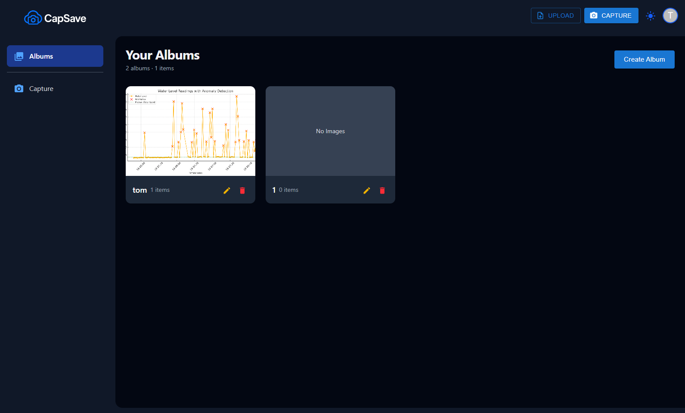
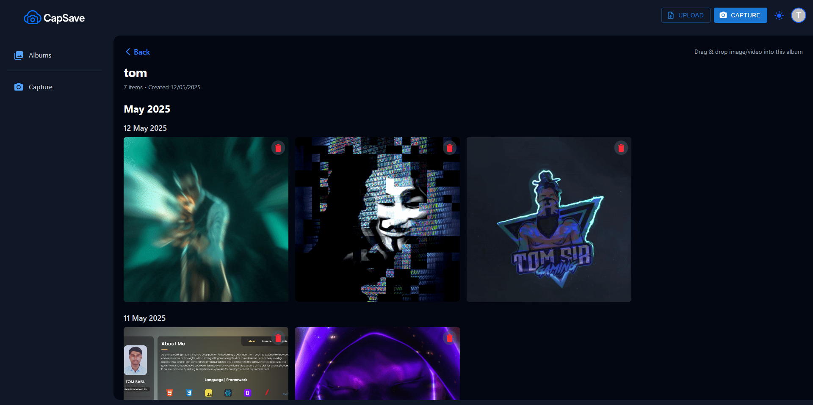
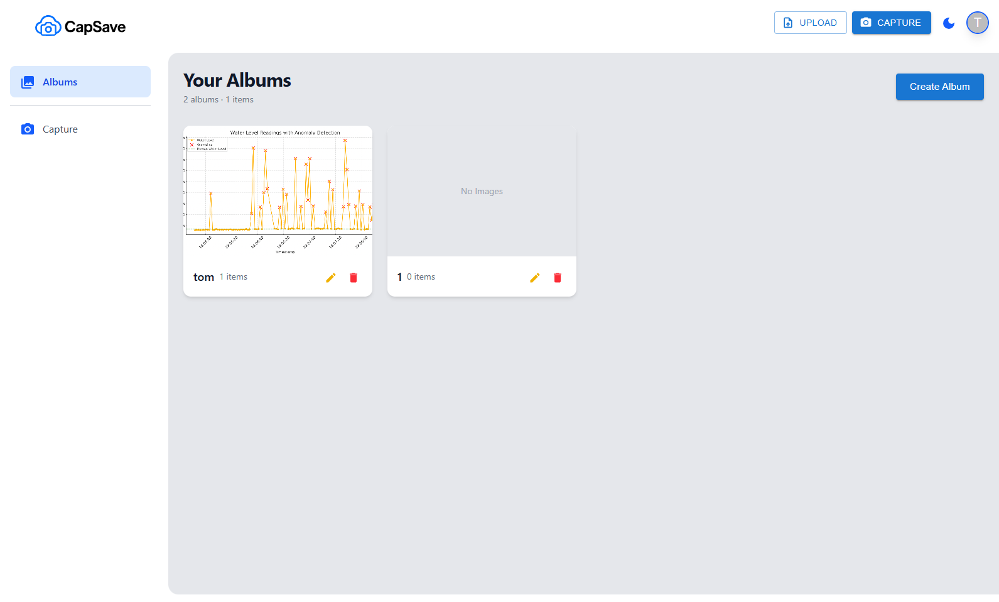

# 🖼️ CapSave – Fullstack Media Upload & Album Management Platform


## 🌐 Live Preview  **[https://capsave.tomsabu.com](https://capsave.tomsabu.com)**

## 🔧 Tech Stack

| Technology | Why It’s Used |
| ----- | ----- |
| **React.js** | Build fast, component-based, responsive frontend for web app. |
| **TailwindCSS** | Quickly design clean, responsive UI without writing custom CSS. |
| **Express.js** | Build lightweight backend REST APIs to handle albums and media upload. |
| **MongoDB Atlas** | NoSQL database to store user, album, and media metadata easily and flexibly. |
| **Docker** | Containerize backend app to run independently across any server. |
| **AWS** | Deploy Docker backend in servers. |
| **Cloudflare Pages** | Host the frontend (React app) quickly with CDN speed and easy deployment. |
| **Cloudflare DNS** | Manage domain/subdomain routing securely and efficiently. |
| **GitHub** | Version control, code collaboration, and automate deployment pipelines (CI/CD). |
| **AWS S3 Bucket** | Store uploaded photos and videos securely and retrieve them via backend APIs. |

---

## ⚙️ Environment Setup

You need to configure both **backend** and **frontend** `.env` files to run CapSave locally. take copy from .env.example

### 📂 Backend `.env` (in `backend/.env`)

```env
PORT=5000
MONGODB_URL=
FIREBASE_ADMIN_SDK_BASE64=
AWS_ACCESS_KEY_ID=
AWS_SECRET_ACCESS_KEY=
AWS_REGION=
S3_BUCKET_NAME=
```

- Encode your entire Firebase Admin SDK JSON file as base64 and assign it to `FIREBASE_ADMIN_SDK_BASE64`.
- Never commit real `.env` values to source control.

---

### 📂 Frontend `.env` (in `frontend/.env`)

```env
VITE_FIREBASE_API_KEY=your_firebase_api_key
VITE_FIREBASE_AUTH_DOMAIN=your_project.firebaseapp.com
VITE_FIREBASE_PROJECT_ID=your_project_id
VITE_FIREBASE_STORAGE_BUCKET=your_project.appspot.com
VITE_FIREBASE_MESSAGING_SENDER_ID=sender_id
VITE_FIREBASE_APP_ID=your_app_id
VITE_FIREBASE_MEASUREMENT_ID=G-XXXXXXXX
VITE_API_BASE_URL=http://localhost:5000
```

- Prefix all frontend variables with `VITE_` as required by Vite.
- `VITE_API_BASE_URL` should point to your running backend server.

---

## 🚀 Setup Instructions

## 📦 Installation Requirements

- **Node.js** ≥ v18.x (recommended)
- **Docker** & Docker Compose installed on your machine

### Option 1: Docker Dev Environment

```bash
docker-compose -f ./docker-compose.dev.yml up --build
```
This spins up both frontend and backend in a development-friendly Docker setup.

### Option 2: Local Development

```bash
# 1. Start Frontend
cd frontend
npm install
npm run dev
```

Open a new terminal:

```bash
# 2. Start Backend
cd backend
npm install
npm run dev
```

## 📚 Documentation

- 📖 Eraser Doc: [CapSave Design Docs](https://app.eraser.io/workspace/ECxICX8E0TyYn47dV6cJ?origin=share)

---

## 🧪 API Endpoints

### 🔐 User API

| Method | Endpoint         | Description                         |
|--------|------------------|-------------------------------------|
| POST   | `/v1/users`      | Just Save userdata to mongodb       |

### 📁 Album API

| Method | Endpoint                   | Description                            |
|--------|----------------------------|----------------------------------------|
| GET    | `/v1/albums`               | List all albums for authenticated user |
| POST   | `/v1/albums`               | Create a new album                     |
| PUT    | `/v1/albums/:albumId`      | Rename an existing album               |
| DELETE | `/v1/albums/:albumId`      | Delete album and associated media      |

### 🖼 Media API

| Method | Endpoint                   | Description                            |
|--------|----------------------------|----------------------------------------|
| POST   | `/v1/media`                | Upload a photo/video to a specific album (multipart) |
| GET    | `/v1/media/:albumId`       | Fetch all media items from an album    |
| DELETE | `/v1/media/:mediaId`       | Delete a media item                    |

---


## 📸 Screenshots

### Dark Mode  


### Albums View  


### Light Mode  
